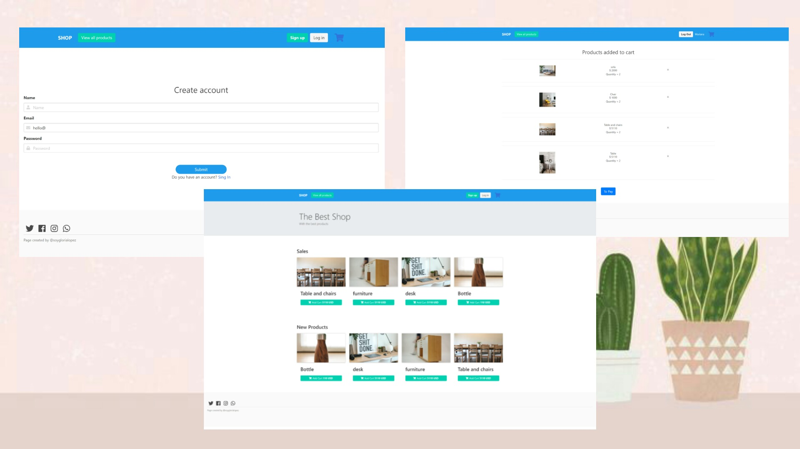

### Store


_Una e-commnerce sencilla, en la cual podras crearte una cuenta, loguearte, comprar productos._  <br>
_Listar productos, ver cuales son las ofertas_ <br> 


### Cómo esta creado el Programa 🔧
Para la creación de esta página, se utilizó como lenguaje principal JavaScript, tanto para el backend <br>
como para el frontend <br>

<br>

 * <strong> Dependecias</strong> <br>
   * "express":  Framework principal  <br>
   * "pg": Para hacer una conección con la Base de Datos de Postgres<br>
   * "bcrypt": Para encriptar y desencriptar las contraseñas <br>
   * "pug": Para la creción de las vistas<br>
   * "Boostrap": Para los componentes que necesiten js<br>
   * "Bulma": Para darle estilos a la páginas con css<br>


### Pre-requisitos 📋

* Tener instalado Node y Postgres<br>

    

## Guia 🚀

_Estas instrucciones te permitirán obtener una copia del proyecto en funcionamiento en tu máquina local para propósitos de desarrollo y pruebas._

* Clonar el proyecto ``` git clone https://github.com/soyglorialopez/Store.git```
* Instalar las dependecias ``` npm init ```
* Crearse una Base de Datos en postgres.
* Crear con la tabla de user con los campos de <br>
    "id", int<br>
     "name"  string<br>
     "email" string<br>
      "password" string<br>
* Crear con las tablas products con los campos de:  <br>
   "id", int<br>
     "name"  string<br>
     "price" t<br>
      "description" float<br> 
    "tags"  array<br>
     "stock" int<br>
      "img" string<br> 
* Al archivo env.text cambairle el nombre por .env y completar con los datos<br>


## Despliegue 📦

```
npm run start 
```
```
npm run dev:debug
```
